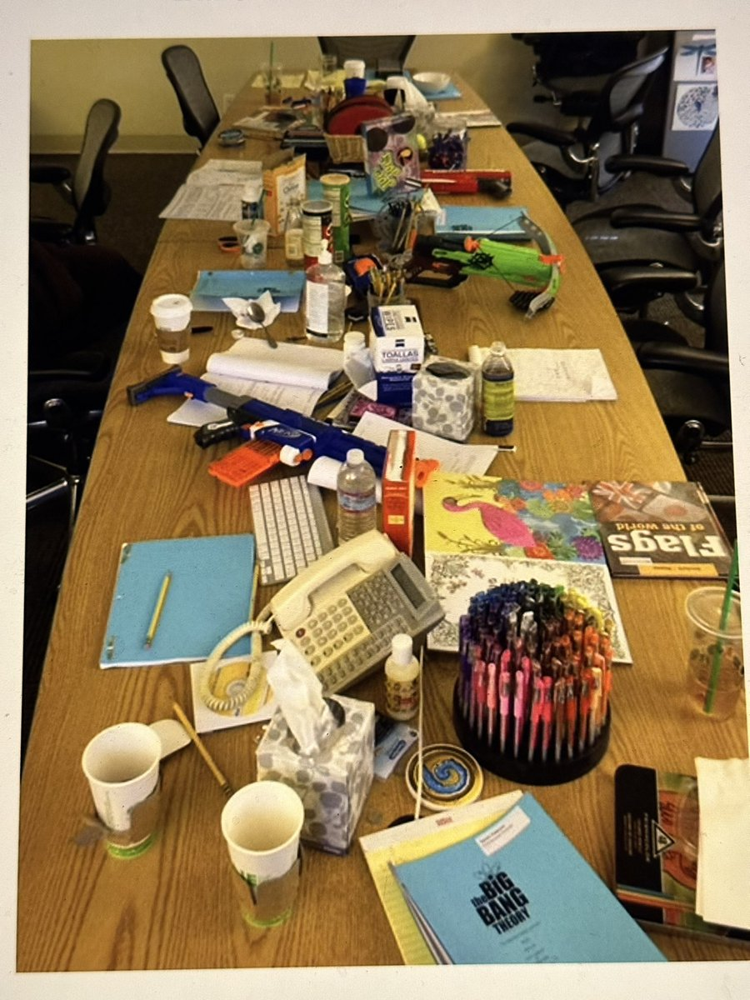

This is famous “writers’ table” where Big Bang Theory episodes were written. How many types of objects can GPT-4o and Claude identify with name? But before looking up answer in the thread, give it a try yourself 🧐

GPT-4o identified only 26 objects vs Claude 3.5 Sonnet did 45 which includes rubber band, paper clip, lip balm and USB drive! My own score was mere 37.

[Discussion](https://x.com/sytelus/status/1820084546114904207)
