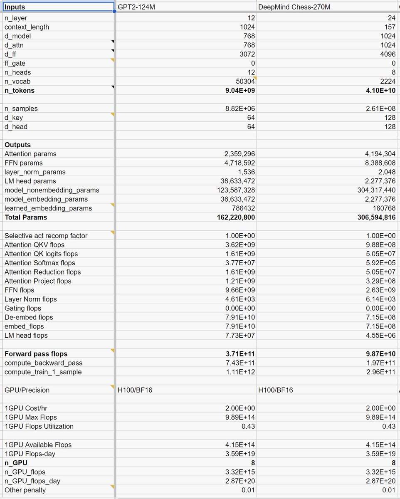
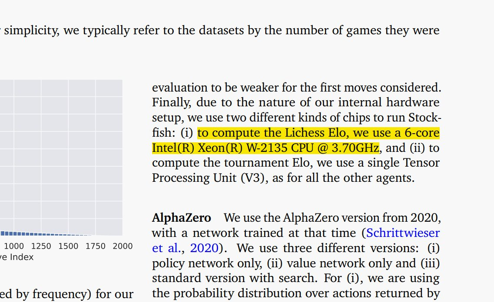

DeepMind's chess paper has sharply divided AI community:

Some are pointing to it as evidence that LLMs can do reasoning and planning while others say it's just lookup table/memorization.

In reality, I think the paper uncovers something else if you look into details! 🧵 

First, the authors are trying to distill Stockfish engine into a model. One would think student wouldn't do better than the teacher but the teacher Elo is 2713 while student gets 2895. 

So student is doing better than teacher!

But this is still not the most  interesting part!!

The Elo ratings at this level are unreliable so let's not put too much weight into these differences.

A more important question is:

Are the FLOPs spent by Stockfish 16 to compute the next move same as the FLOPs spent by the model?

There are interesting consequences of this.

The details are buried in appendix and scant but for the 50ms limit and hardware used (Intel Xeon W-2135 CPU @ 3.70GHz), my estimate of FLOPs used by Stockfish 16 to compute next move is between 8 to 16 GFLOPs. 

Using the details in the paper, I tried to compute the FLOPs used by the forward pass of the model and it comes out to be between 49-98 GFLOPs.

In other words, the model is spending at least 4X more  FLOPs to do the same computation!

So, what are the takeaways?

For problems like chess, it's all eventually come down to how many FLOPs can you spend? It turns out ~16 GLOPs is quite enough to beat humans!

The most interesting thing for me in DeepMind paper is more or less general recipe of distilling possibly an arbitrary probabilistic algorithm into a neural model. 

Sure, it's 4X less efficient at the moment but it's compositionally enormously powerful paradigm.

Now the time for that bigger insight:

Stockfish engine is littered with all kind of complexities built with traditional computational primitives of conditionals, branching, data movements and so on.

What DeepMind paper points to is that all of these can potentially be distilled… [continue reading](https://x.com/sytelus/status/1848160140278555049)
