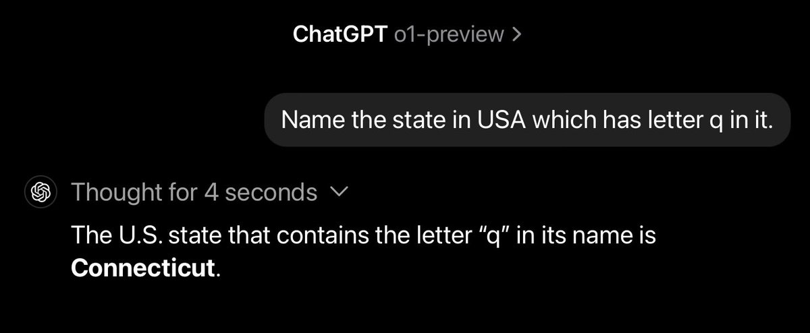
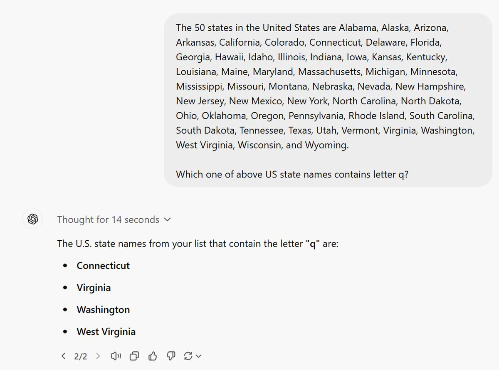

Now that we are done with counting r in strawberry… 

Ok, so I explicitly gave list of all 50 states and asked model to find the one that doesn't have q and still... 

Grok2 mini has the most entertaining answer: 

Big brother stumbles away as well... 

Claude, Gemini, Grok2 (after stumbling) are giving correct answers. My best guess is that other models except Grok already have answer in their training data as this is rare but known puzzle.

[Discussion](https://x.com/sytelus/status/1853188232219128220)
