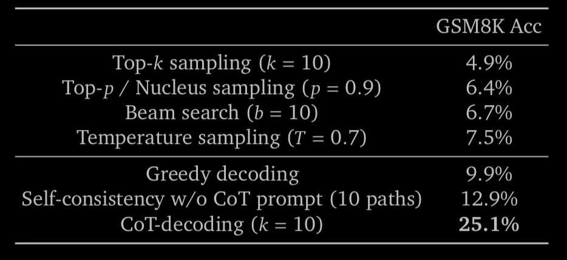

Tokenization and decoding are two weak links in current setup with transformer based models. You often hear things like “oh well, greedy decoding is good enough” but in reality we have too many bandaids that makes it work.

The CoT decoding paper illustrates this beautifully. 🧵 

The assertion in CoT decoding paper is that the probability distribution out of model is misleading. There often exist a decoding trajectory with CoT+answer even when prompt doesn’t have CoT and even when model isn’t instruction-tuned! 

How do we lock-in on this trajectory?

Authors find cool trick that sometimes doubles the GSM8K perf just by modifying decoding! The main observation is that the probability disparity between top 1st and 2nd token is largest when model is more confident. So, what if we sum up that delta for each trajectory?

Then generate candidate trajectories by trying first k top tokens for 1st decoding step and generating the rest by greedy approach. The winner is one with max sum of deltas. 

This might feel like crude approach but it seems to work well, at least on models without instruction…

The intuition behind why it doesn’t work as well for instruction tuned models is CoTs are automatically induced by IT. In other words, IT makes greedy decoding much more tolerable by inducing CoT more often.

Paper: <https://arxiv.org/abs/2402.10200>

Via amazing [@rohanpaul_ai](https://x.com/rohanpaul_ai)

[Discussion](https://x.com/sytelus/status/1859570043538862159)
