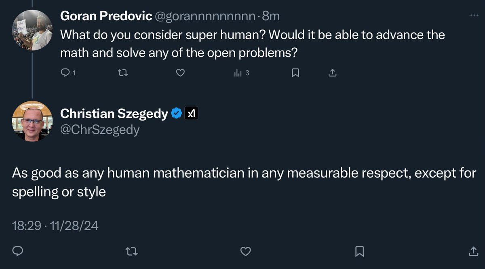

I would like to define super human AI at math as the one which solves each of 652 open Erdos problems.

I think this sets the difficulty bar and dataset size just right.

Erdos problems: <http://www.erdosproblems.com>

Related thread: <https://x.com/ChrSzegedy/status/1862322895340675237>

[Discussion](https://x.com/sytelus/status/1862325849573507262)
