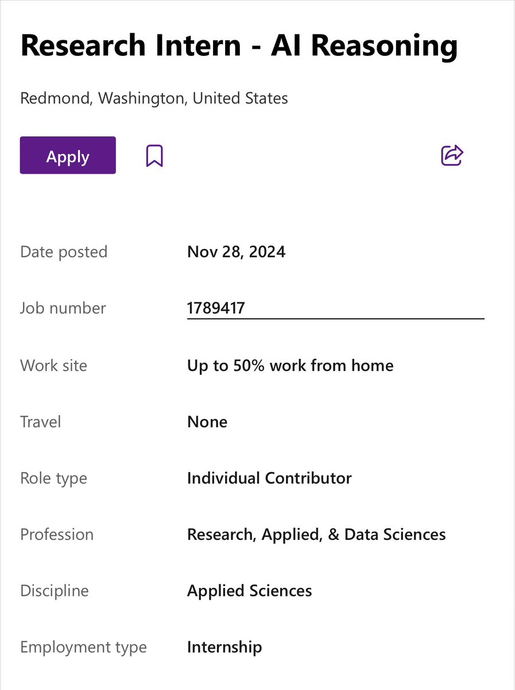

Do you want to work on exciting AI and reasoning problems this summer? 

We have an intern position just for you!

The internships for PhD students at Microsoft Research is one amazing experience and opportunity to work with world class researchers and engineers! 👇 

Apply here today:

<https://jobs.careers.microsoft.com/global/en/job/1789417/Research-Intern---AI-Reasoning>

This is a rare and unique opportunity to work on some very rewarding reasoning problems along side the members of Phi team and our product group partners.

Excited? Apply TODAY!!

We look forward to talk with you soon!

CC: [@ylongqi](https://x.com/ylongqi) [@soshsihao](https://x.com/soshsihao) [@HJiao](https://x.com/HJiao)

I am at NeurIPS and if you had like to chat about this internship, my DMs are open!

[Discussion](https://x.com/sytelus/status/1866639121097298372)
