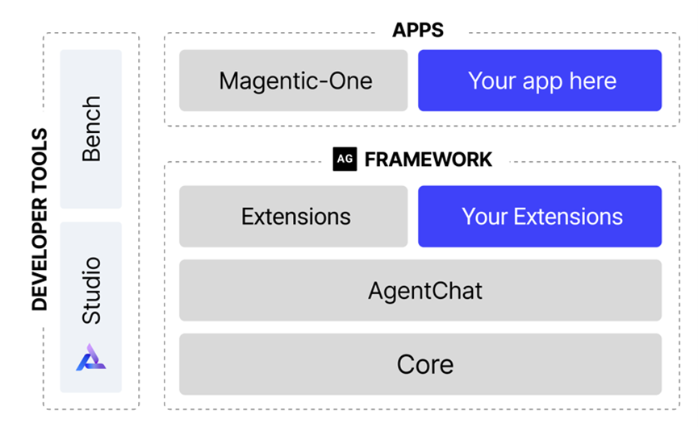

Our sister team at Microsoft Research just released huge improvements in AutoGen! This is one of the most popular open source agentic framework and now beefed up with number of great new capabilities, extensibility and completely revamped codebase!! 

More at <https://www.microsoft.com/en-us/research/blog/autogen-v0-4-reimagining-the-foundation-of-agentic-ai-for-scale-extensibility-and-robustness/>

[@AhmedHAwadallah](https://x.com/AhmedHAwadallah) [@bansalg_](https://x.com/bansalg_) [@adamfourney](https://x.com/adamfourney)

[Discussion](https://x.com/sytelus/status/1879239244612575740)
