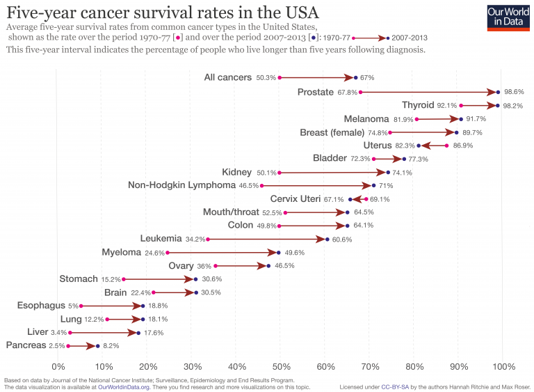

We are improving 0.4%/yr in 5-year survival rate for cancer. At this rate cancer would be "cured" in 2078. Given that this would be the only major cause of natural death, this may also mean we would enter in era where most humans may regularly live long lives, perhaps 100+ years. 

[Discussion](https://x.com/sytelus/status/1098538875318747137)
