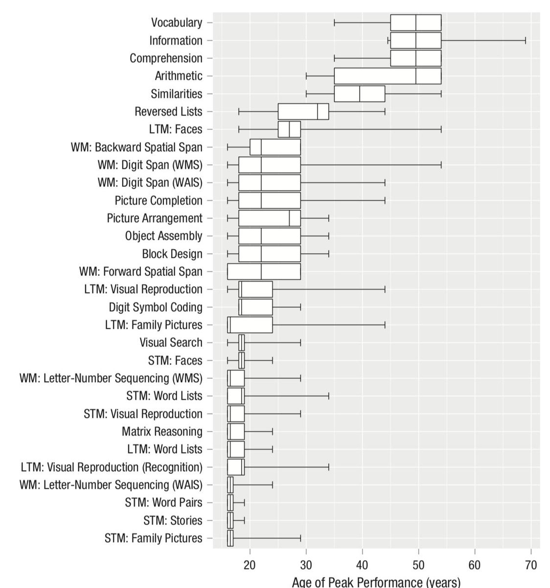

When does cognitive functioning peak in humans? It turns out different cognitive tasks peak at different age. 
<https://blogs.scientificamerican.com/beautiful-minds/when-does-intelligence-peak/> 

[Discussion](https://x.com/sytelus/status/1101701378664161280)
