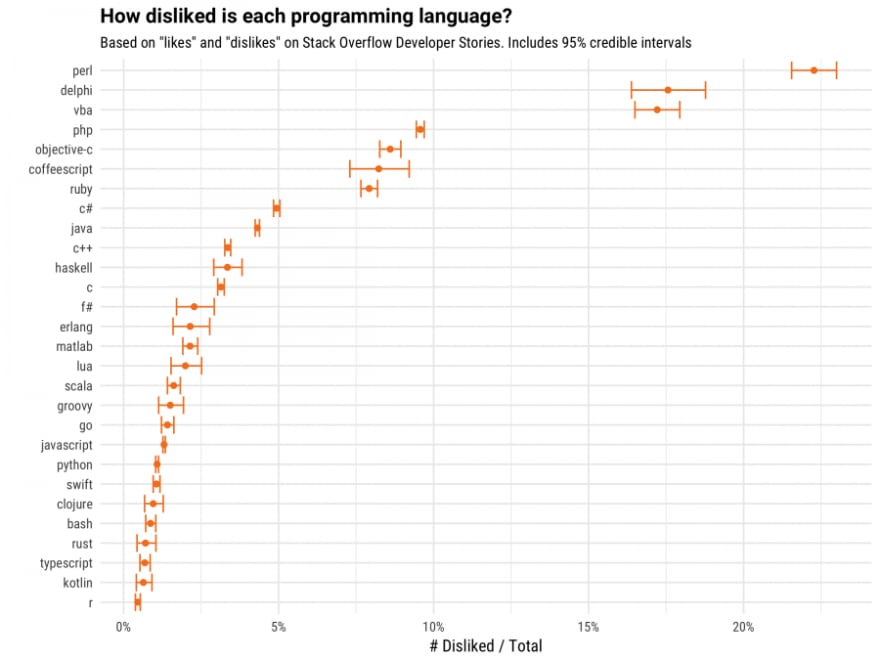

How disliked each programming language is? The interesting thing is the confidence interval which I'd say suggest "religiousness" of the language. I can go on to defend Delphi all day long. 

[Discussion](https://x.com/sytelus/status/1159627532666200064)
