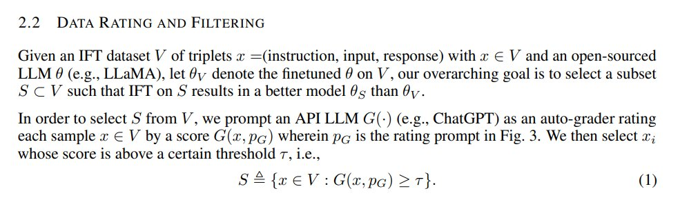

Assume that you invented a novel data filtering technique: Ask ChatGPT to rate each data point in your dataset from 0 to 5 and filter out everything below 4.5. 
Here is how you describe your idea in your paper: <https://x.com/rasbt/status/1686699105878237185> 

[Discussion](https://x.com/sytelus/status/1686907796326154242)
