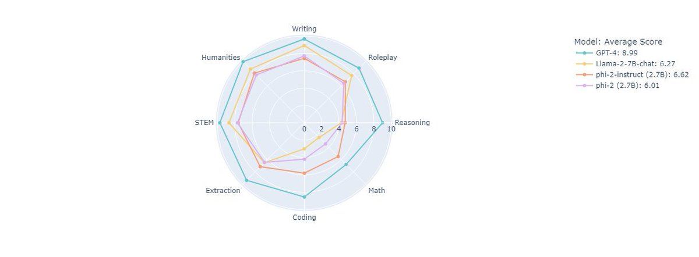

Phi-2 is Built by our group at MSR! At 2.7B, it's smol model but more capable and robust than previous versions. 

Perfect for finetuning and available in Azure now!

Here's how it measures up: <https://x.com/SebastienBubeck/status/1724854157004190095> 

[Discussion](https://x.com/sytelus/status/1724857907542724980)
