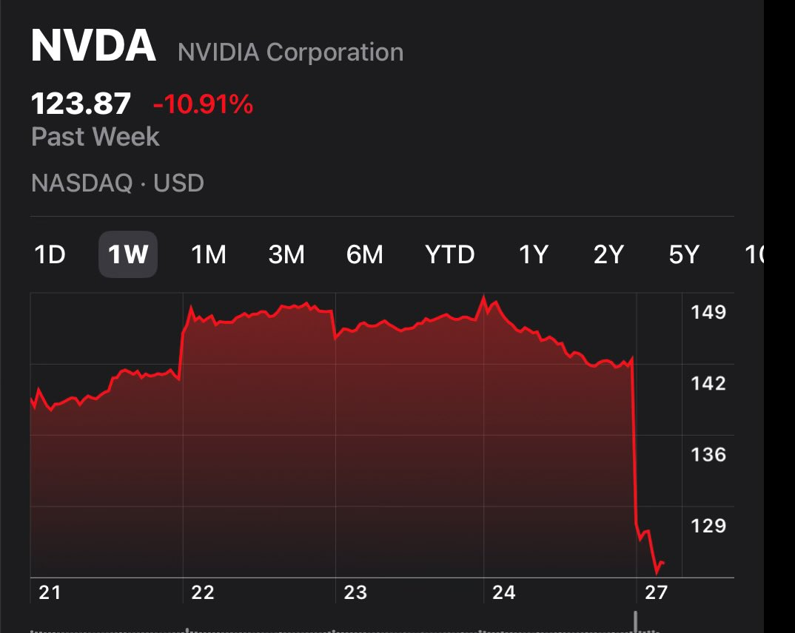

Do people even understand that majority of chip buys are for inference and not training? 

Inference needs are going to grow exponentially yoy no matter how much juice we try to squeeze out. 

[Discussion](https://x.com/sytelus/status/1883901010596479079)
