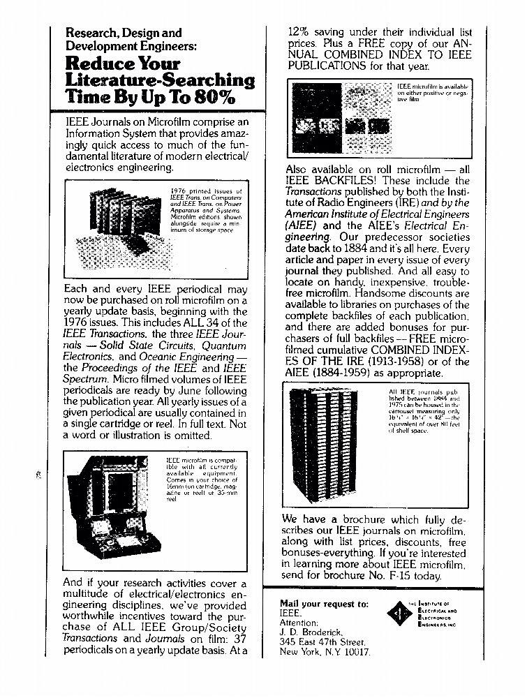



Before Internet (I believe) the magic was annual combined index for journals that made searching past issues possible with fair ease. Interestingly, amount of high impact research (but not the total volume) was significantly higher before Internet: <https://www.theatlantic.com/science/archive/2018/11/diminishing-returns-science/575665/> 

[Discussion](https://x.com/sytelus/status/1094638398415953920)
