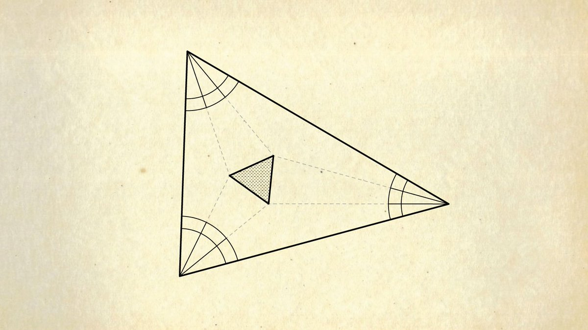

RT [@theAlbertChern](https://x.com/theAlbertChern): The intersections of the angle trisectors of any triangle form an equilateral triangle. 

[Discussion](https://x.com/sytelus/status/1396277979781554176)
