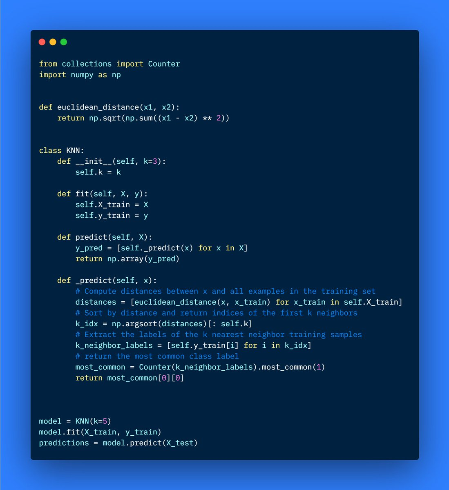

RT [@python_engineer](https://x.com/python_engineer): K Nearest Neighbors (KNN) implemented from scratch in 30 lines of Python code: 

[Discussion](https://x.com/sytelus/status/1446754187501453320)
