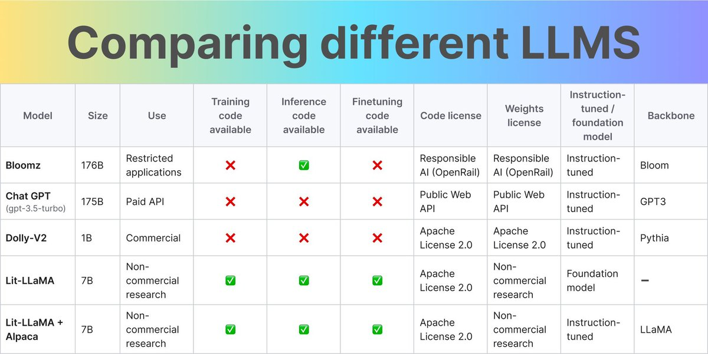

RT [@_willfalcon](https://x.com/_willfalcon): Which opensource LLM should you use? 

We tested all of them 🤯🤯

<https://lightning.ai/pages/community/community-discussions/the-ultimate-battle-of-language-models-lit-llama-vs-gpt3.5-vs-bloom-vs/> 

[Discussion](https://x.com/sytelus/status/1652133513435705345)
