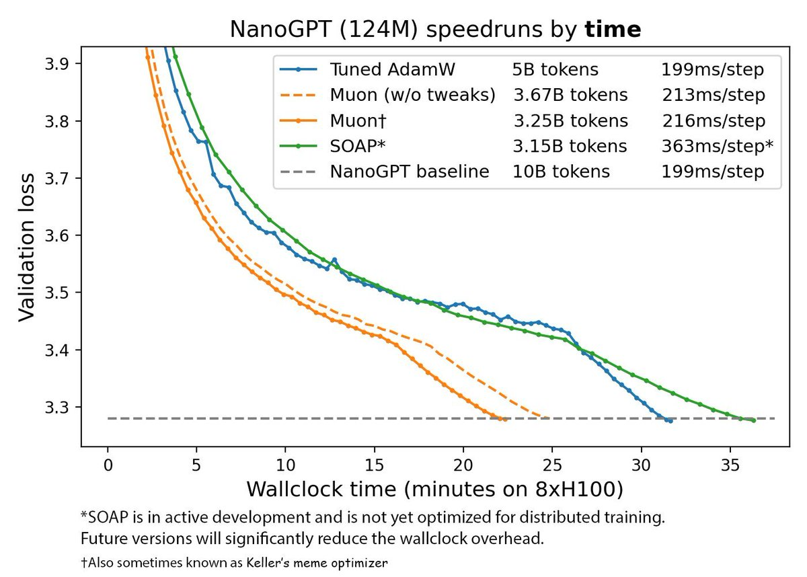

There is something beautiful and amazing happening right now. A new optimizer that is almost twice as efficient than AdamW is being born right in front of our eyes!

Many people are probably rolling their eyes just reading this but this time it feels different! 🧵 

We have a mini cottage industry which has tradition for putting out papers claiming to beat Adam annually that just never seems to pan out. There seems to be always some hidden catch, if things are reproducible at all. So, rightfully, many have became numb to these announcements.

So, here's the twist! If you are into sport of speed training CIFAR-10, you aren't stranger to [@kellerjordan0](https://x.com/kellerjordan0). I left the sport couple of years ago but he eventually broke jaw-dropping 3s barrier!

Still, there was growing sarcasm for still using CIFAR-10. It was time for change.

So, recently [@kellerjordan0](https://x.com/kellerjordan0) took upon speed training transformers! Instead of keeping everything secret, he recorded his progress in public. Community started parallel experimentation, reported results and soon things were shaping up to be really good!

<https://x.com/kellerjordan0/status/1844820924195106850>

The reason I am ecstatic about this is because I have always felt this is how the research should be done. 

Even in "open" research labs, you will see too many researchers jealously guarding early ideas. The sharing only happens with close friends. There is obsession on…

The result of above rituals and deeply ingrained culture is that it takes months to get any idea out through published paper. When it does get out, it often gets lost in sea of other papers. If someone does notices, improving upon it takes yet another same long arduous cycle.

Keller and others have taken different approach. They released initial ideas as public GitHub repos, not as paper. People can immediately play and improve. Everything can be validated by anyone at anytime. As everything is open, there is no room for cheating and overclaiming.

This is truly distributed real time AI research! Within days Keller and others were able to improve on ideas. Folks who saw promise, jumped in and help parallelize.

In traditional AI research landscape, this feedback cycle would have taken 6+ months instead of just 6 days.

Funny thing is that the optimizer wasn't even named just couple of days ago so people kept calling it "Proposed Optimizer" 😂. Finally, its named as Muon and Keller might get around to write paper some day. 

It's such as fun to see all this happen in real time.

Another important development for achieving o1 like test-time compute scaling is Entropix by [@_xjdr](https://x.com/_xjdr). Both of these ideas coincidentally shaping up at same time!

Very hopeful that this distributed real-time research ideas will replace our current arcane arxiv based culture.

[Discussion](https://x.com/sytelus/status/1845298766863270159)
