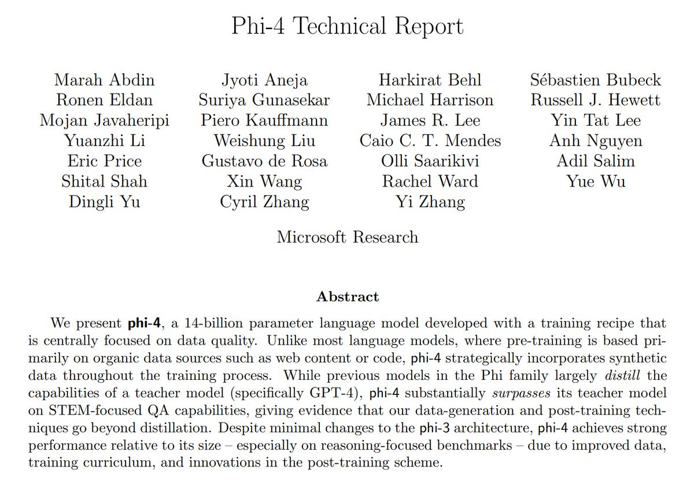

Are you ready for an early Christmas present from our team at Microsoft Research?

Introducing the most powerful smol model ever built in the world!

Welcome to Phi-4! 👇 

Personally, since I started working on Phi project at its inception, this is my most favorite model that we have ever shipped.

Remember prompts that many frontier models including o1-preview struggled with? Phi-4 gave correct answer super fast!

<https://x.com/sytelus/status/1853188232219128220>

Phi-4 achieves this by pushing the art of synthetic data even further to induce reasoning abilities along with new advancements in post-training.

If you have been using Llama 3.x etc for reasoning tasks, you owe it to yourself to try out Phi-4! 

This is the work of super hard working team including [@EldanRonen](https://x.com/EldanRonen) [@BehlHarkirat](https://x.com/BehlHarkirat) [@mojan_jp](https://x.com/mojan_jp) [@marah](https://x.com/marah) [@marah_i_abdin](https://x.com/marah_i_abdin) [@weishliu](https://x.com/weishliu) [@rosaguga](https://x.com/rosaguga) [@OlliSaarikivi](https://x.com/OlliSaarikivi) [@suriyagnskr](https://x.com/suriyagnskr) [@SebastienBubeck](https://x.com/SebastienBubeck) and many others.

Of course, none of this would have been possible without  support from our amazing…

Paper: <https://arxiv.org/abs/2412.08905>

Model is available now to try in Azure: <https://ai.azure.com/explore/models/Phi-4/version/1/registry/azureml>

What's better than tokens? Tokens with logits!!

We hope you will have as much fun playing and creating with this tiny beast of a model as we had building it.

Happy holiday chilln' for ya all🎄🎁.

Oh... and one more thing! if you love to push model capabilities and want to work with us, check out our summer internship position. I am at #NeurIPS and let me know if you had like to chat more about this position.

<https://x.com/sytelus/status/1866639121097298372>

Tagging more people! 
[@NguynTu24128917](https://x.com/NguynTu24128917) [@dingli_yu](https://x.com/dingli_yu) [@xinw_ai](https://x.com/xinw_ai) [@yw_yuewu](https://x.com/yw_yuewu) [@YiZhangZZZ](https://x.com/YiZhangZZZ) [@AdilSlm](https://x.com/AdilSlm) [@_cyrilzhang](https://x.com/_cyrilzhang)

Also, check out our blog post at <https://aka.ms/phi4blog> for some great examples of reasoning tasks where Phi-4 excels!

Way better summary than I can do by one and only [@rohanpaul_ai](https://x.com/rohanpaul_ai). <https://x.com/rohanpaul_ai/status/1867426966305222929>

[Discussion](https://x.com/sytelus/status/1867405273255796968)
